# World Bank Data Analysis using SQL

In this project, I will delve into the credit and grants data collected by the International Development Association (IDA) World Bank. IDA is a part of the World Bank. It provides financial assistance to developing nations and helps them achieve sustainable economic progress and alleviate poverty.

## Key questions
1. Which are the 2 countries with the highest loans from 2017 - 2022? 
2. What is the trend of their loans vs GDP over the years?
3. What is their GDP per capita over the years?

## Key Findings

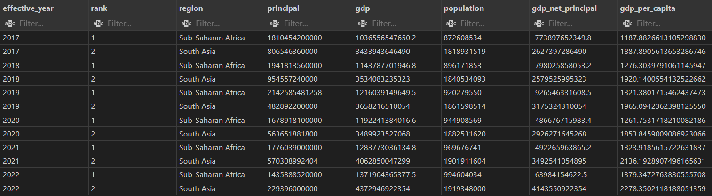

1. ### Principal Amount 
- South Asia and Sub-Saharan Africa have the highest principal amount among all the IDA regions from 2017 to 2022. 

2. ### GDP 
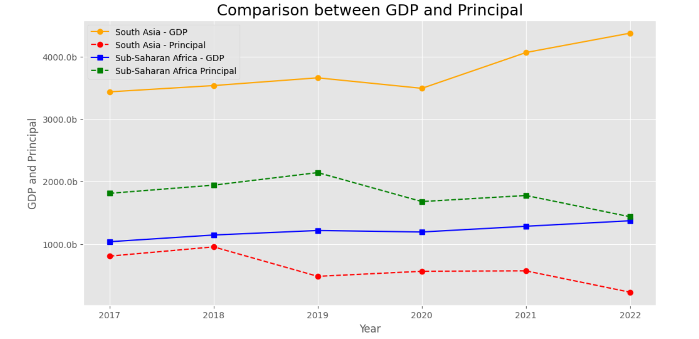
- GDP measures the total value of goods and services produced by each region.
- It has been increasing in both regions over the years. South Asia saw a slight drop in 2020 but GDP had rebounded since then.
- South Asia has a higher GDP compared to Sub-Saharan Africa.This shows that South Asia has a larger overall economy compared to Sub-Saharan Africa.
- GDP in South Asia has been higher than the principal amount over the years.

3. ### GDP net principal
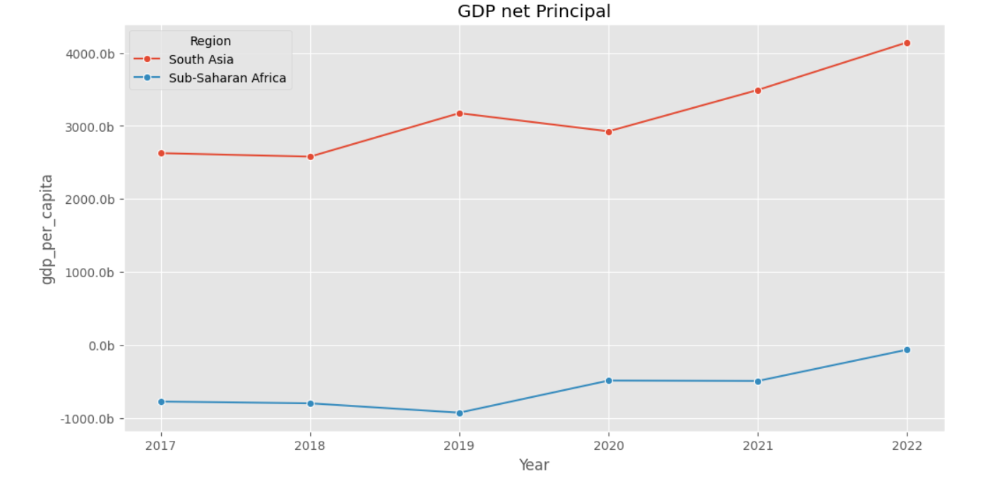
- South Asia's GDP has been exceeding it principal amount over the years. 
- Sub-Saharan Africa has been borrowing more than their GDP. The GDP for the region has been increasing over the years and is almost to the same level of borrowing in 2022.

4. ### Population
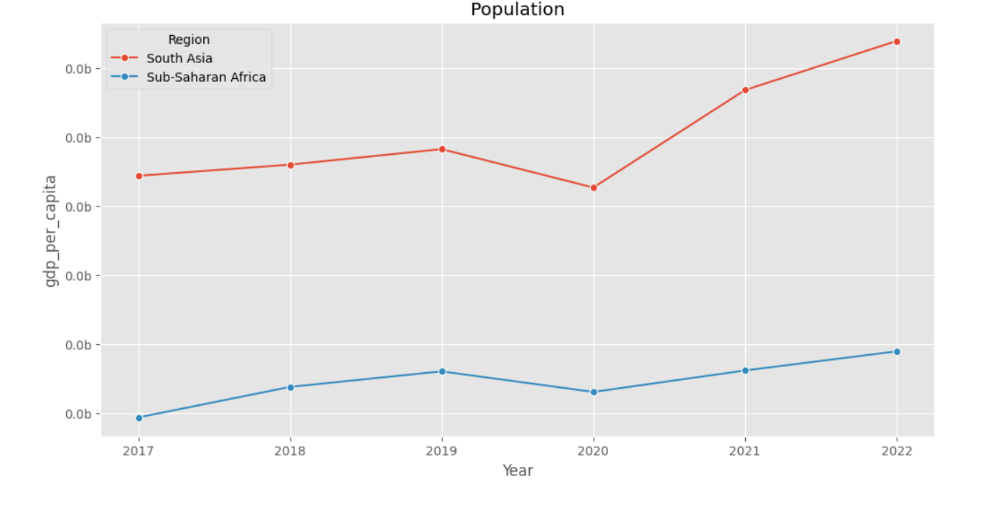
- South Asia has a larger population compared to Sub-Saharan Africa. 
- Population grew in both regions over the years.

5. ### GDP per capita 
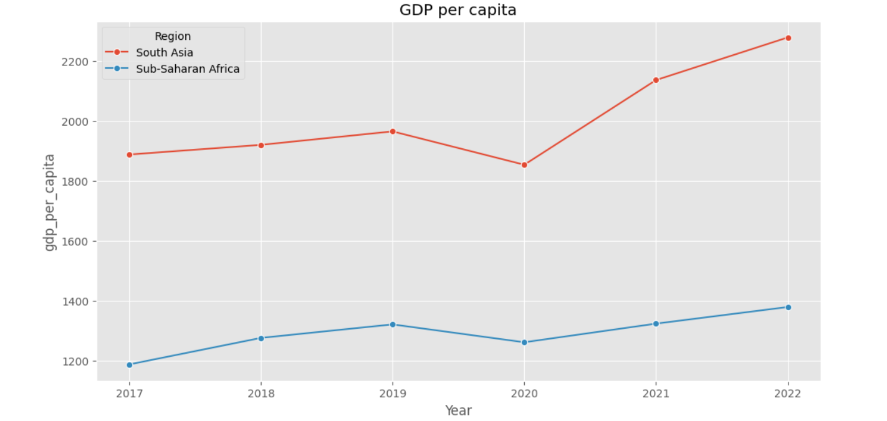
- GDP per capita provides context to the overall wellbeing of individuals in each region by taking population size into consideration
- South Asia has a higher GDP per capita than Sub-Saharan Africa.  
 .

## The Project

### Datasets used
- [IDA Statement Of Credits and Grants](https://finances.worldbank.org/Loans-and-Credits/IDA-Statement-Of-Credits-and-Grants-Historical-Dat/tdwh-3krx/about_data
)
- [World Bank Country and Lending Groups](https://datahelpdesk.worldbank.org/knowledgebase/articles/906519-world-bank-country-and-lending-groups)
- [Total Population](https://data.worldbank.org/indicator/SP.POP.TOTL)
- [GDP(USD)](https://data.worldbank.org/indicator/NY.GDP.MKTP.CD)

### Data Preprocessing

Pandas functions and Google Sheets were used to review and implement standardized naming conventions across all datasets. The following tasks were performed prior to data loading:
1. Data Inspection for NULL and Missing Data
    - Identified the values used to represent NULL or missing data for standardization.
    - Look for data inconsistencies

2. CSV File Cleanup
    - Removed unnecessary spaces and words before the header to ensure proper formatting and accurate header identification.

3. Create a csv file based on [World Bank Country and Lending Groups](https://datahelpdesk.worldbank.org/knowledgebase/articles/906519-world-bank-country-and-lending-groups)
    - The region names in [IDA Statement Of Credits and Grants](https://finances.worldbank.org/Loans-and-Credits/IDA-Statement-Of-Credits-and-Grants-Historical-Dat/tdwh-3krx/about_data) are inconsistent. Different spellings are used for the same region. 
    - Instead of correcting each region on the orignal data, this will be used to as a reference table.

### Data Loading

To store and manage the cleaned and processed data, the following tables were created using PostgreSQL  

     credit_grants  
	 world_popn  
	 gdp  
	 countries_regions

Due to the size of the credit_grants dataset (1.3million rows), `psycopg2` library was used to load data into the SQL table in batches.

### Data Analysis

A view was created to :

-  match each country in the 'credit_grants' table with its corresponding region name from the 'countries_regions' table, thereby correcting any inconsistencies in region names.
- extract data for the year 2017 to 2022.

I opted for view instead of Common Table Expression (CTE) because I will be using the result over multiple queries. 

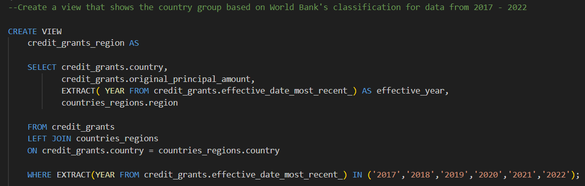

I used a few CTEs to answer all three questions and presented the result in a single table. CTE breaks a complex query down into smaller and manageable chunks. It is also a lot easier to read.

The first CTE finds the total principal amount for each region annually. SUM was used to find the total principal amount of the data queried in the view. The result was GROUP BY region and effective year. 

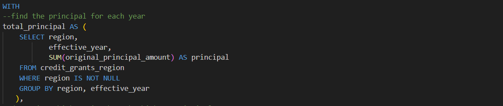

Next, I assigned a rank to the total principal amount. The result was PARTITION BY effective year and ORDER BY the total principal amount. This will be used in the main query to find out which are the countries with the highest principal amount.

The 3rd and 4th CTEs were created to find the total population and total GDP in each region for the year 2017 to 2022. Subquery is used to ensure that I do not double count the population and GDP for each regions.

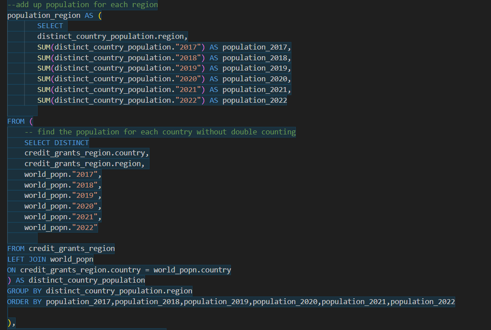

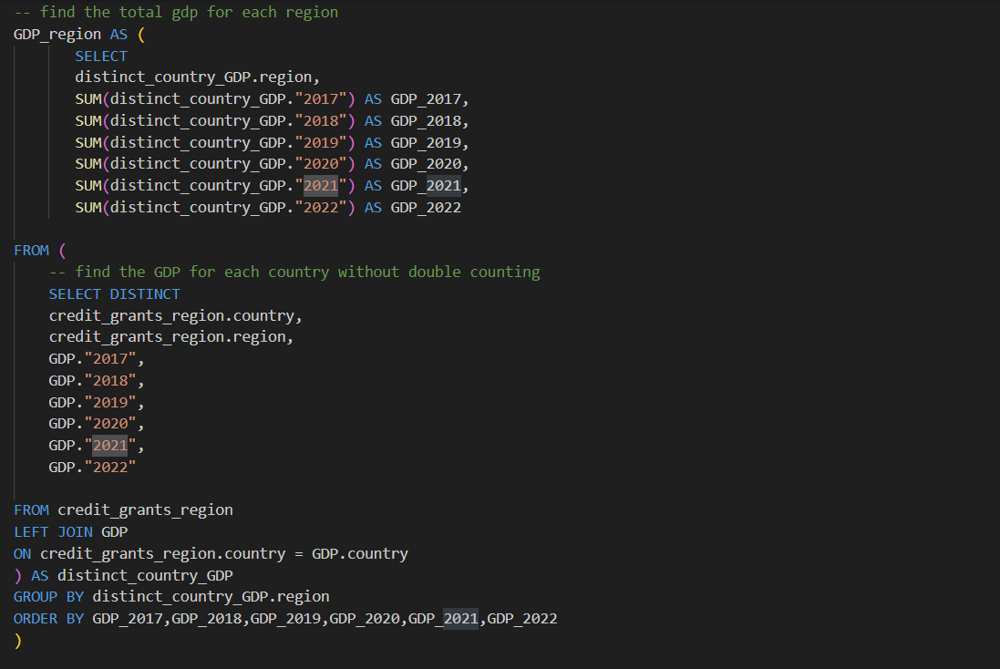

The population and GDP data for different years are stored in separate columns (population_2017, population_2018 etc). I wanted to transform them into a single column so that I can present my results in a clear and concise way. CASE was used in the main query to convert these data from wide to long format, based on the year. 

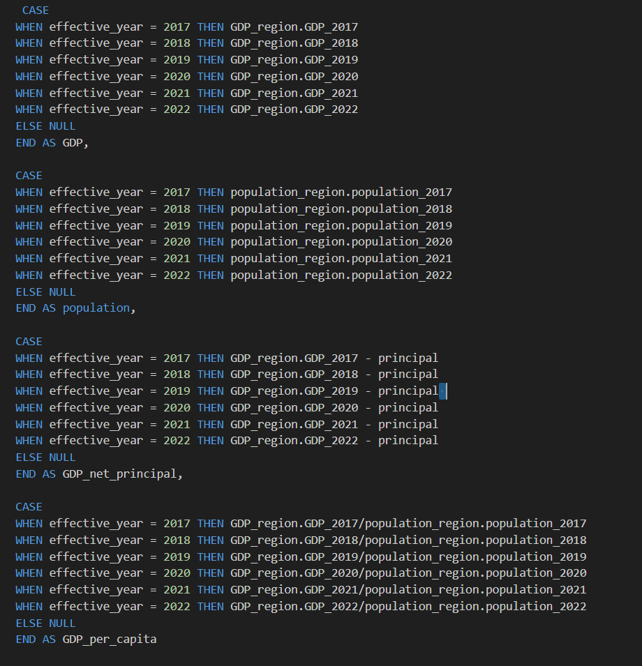

The CTEs above were LEFT JOIN based on regions. The 2 regions with the highest principal amount are filtered by the rank.

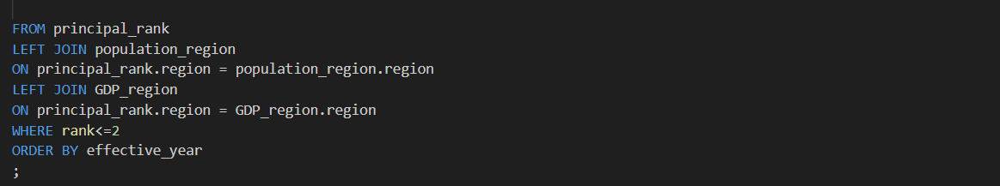
## Data Visualization
- `psycopg2` in a Jupyter Notebook is used to create a cursor object and execute the SQL query
- The query result is loaded into a `panda` dataframe
- `seaborn` line plot was used for the visualization of data

## What I Learned
1. Use psycopg2 library to load a big dataset in batches
2. When to use view vs CTE
3. Combine multiple tables using JOIN
4. Use CASE to pivot data from a wide to long format
5. Create a cursor object and execute the SQL query in jupyter notebook
5. Solve a complicated query and present it in a clear and concise manner

[images\1_view.png]: images/1_view.png
